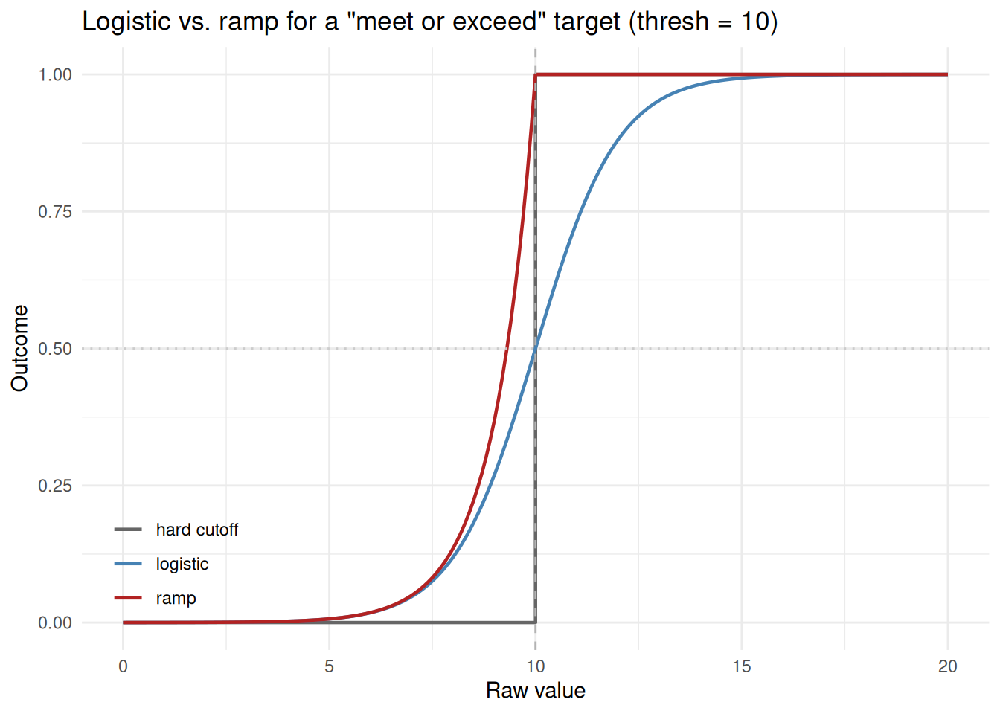
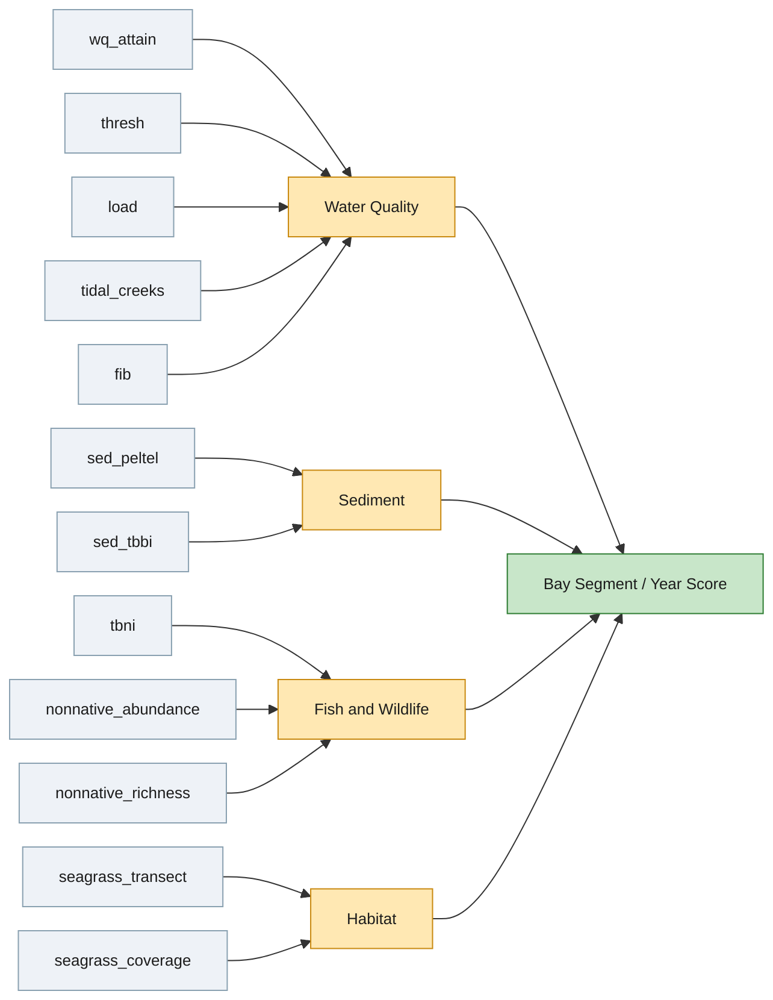
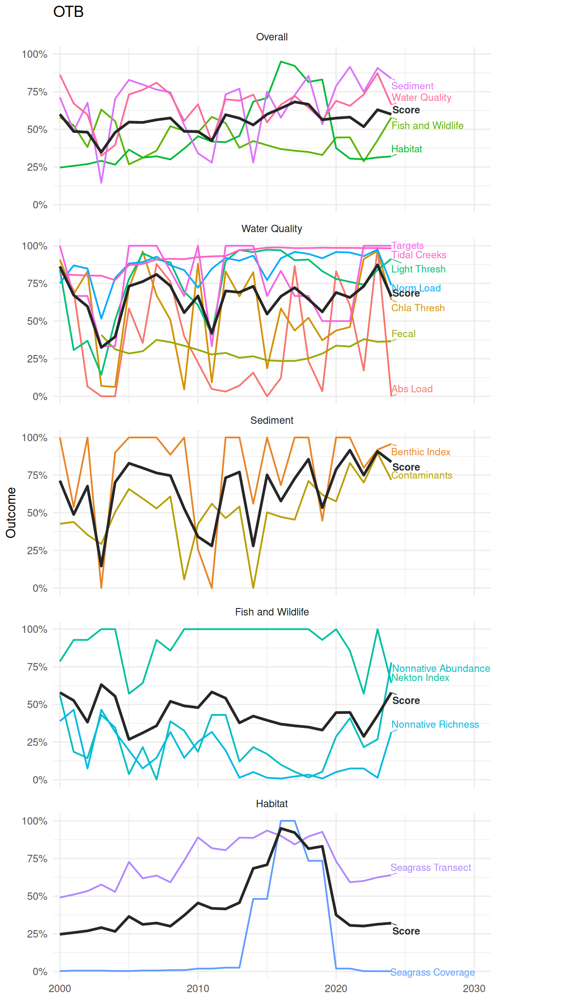

# Report Card Scoring

This article describes the full workflow for creating the bay segment
annual report card. This includes descriptions of each individual
indicator, converting raw indicator values to a common 0-1 outcome
scale, combining indicators into category scores and an overall bay
segment score, and visualizing the results. The sections below describe
the cagories and the indicators within each category, how scoring is
calculated, how the scores are combined across indicators and
categories, and methods for visualizing the results.

## Water Quality

### Targets

Combines chlorophyll and light attenuation attainment management targets
into a single continuous outcome. Both are derived from an integer value
from 0 to 3 that describes a magnitude and duration of exceedance for
the target as described in the tbeptools [water quality
vignette](https://tbep-tech.github.io/tbeptools/articles/intro.html).
The two integer values for chlorophyll and light attenuation are summed
to derive the outcome score, with lower values giving a higher (better)
outcome. These outcomes come directly from the management targets for
each bay segment.

``` r

wqattain <- anlz_wq_attain(epcdata)
```

### Chlorophyll and Light Thresholds

Compares annual mean chlorophyll and light attenuation values directly
against bay-segment-specific thresholds, independent of the combined
attainment score above. Each gives its own threshold outcome as a smooth
logistic transition by default or a hard binary 0/1 with
`smooth = 'none'` (see [Scoring](#scoring)). Values below the threshold
receive better outcomes.

``` r

wqthresh <- anlz_wq_thresh(epcdata)
```

### Nutrient and Hydrologic Loading

Compares total nitrogen load and a hydrologically-normalized loading
against fixed bay-segment thresholds, each as its own threshold outcome.
Results are determined using a smooth logistic transition by default, or
a hard binary 0/1 with `smooth = 'none'` (see [Scoring](#scoring)).
Values below the threshold receive better outcomes.

``` r

totanndat <- util_rdataload("https://github.com/tbep-tech/load-estimates/raw/main/data/totanndat.RData")
wqload <- anlz_wq_load(totanndat)
```

### Tidal Creeks

Assigns each tidal creek to a bay segment, then scores it continuously
from a 10-year window of counts of creeks in each management category
(`monitor`/`caution`/`investigate`/`prioritize`). Nominal categories are
assigned to numeric values in the range from 0-1. Creek scores are then
averaged by bay segment/year, weighted by creek length so longer creek
segments contribute proportionally more.

``` r

wqtidalcreeks <- anlz_wq_tidalcreeks(tidalcreeks, iwrraw, yrs = 1990:2024)
```

### Fecal Indicator Bacteria

Scores each bay segment/year from enterococcus monitoring data using
`exceed_rate`, a continuous, one-sided 90% upper confidence estimate of
the true exceedance rate (0-1, lower is better), rescaled to an outcome
as `1 - exceed_rate`. This is a continuous analog of the A-E letter
grade the same underlying calculation also produces.

``` r

wqfib <- anlz_wq_fib(enterodata)
```

## Sediment

### Contaminants

Scores each bay segment/year directly from its average sediment
contamination score (PEL/TEL, `ave`), log-transformed since its A-F
grade breakpoints are geometrically spaced.

``` r

peltel <- anlz_sed_peltel(sedimentdata, yrs = 1993:2024)
```

### Benthic Index

Scores each bay segment/year from the median of its station-level Tampa
Bay Benthic Index (TBBI) scores (0-100), rescaled continuously over
TBBI’s own grade breakpoints (Degraded below 73, Intermediate 73-87,
Healthy above 87). Breakpoint scoring is used, where outcomes below 73
receive 0, those above 87 receive 1, and those from 73-87 are scaled
proportionally from 0-1.

``` r

tbbi <- anlz_sed_tbbi(benthicdata)
```

## Fish and Wildlife

### Nekton Index

Scores each bay segment/year 0-100 with the Tampa Bay Nekton Index
(TBNI), then rescales to an outcome using TBNI’s own grade breakpoints
(On Alert below 32, Caution from 32 to 46, Stay the Course above 46).
Scores below 32 receive 0, scores above 46 receive 1, and scores between
32 and 46 are scaled proportionally from 0-1.

``` r

tbni <- anlz_fw_tbni(fimdata)
```

### Non-natives

These functions are R-based equivalents of those used in the Python
pipeline in the [tbep-invasives](https://github.com/tbep-tech)
repository (`src/tbep_invasives/steps/report_cards.py`). The
`nonnative_obs()` function returns non-native species abundance
(observations per unit area per year) and richness (unique species per
unit area per year) by bay segment, both of which are then converted to
percentiles and reversed to an outcome from 0-1 (higher
abundance/richness is worse).

``` r

nonnative_obs <- anlz_fw_nonnative_obs()
nonnative_abundance <- anlz_fw_nonnative_abundance(nonnative_obs)
nonnative_richness  <- anlz_fw_nonnative_richness(nonnative_obs)
```

## Habitat

### Seagrass Transects

Estimates frequency of seagrass occurrence (0-100) at each bay
segment/year from transect monitoring data, then linearly rescales to an
outcome from 0-1.

``` r

trnsct <- anlz_hab_seagrass_transect(transect)
```

### Seagrass Coverage

Compares mapped seagrass acreage against a fixed per-segment target.  
A “ramp” threshold outcome is used where an outcome of 1 is received if
the threshold is met, whereas outcomes for acreages less than the
threshold reduce toward 0 as coverage decreases. The targets are the
baywide 40,000-acre seagrass coverage target apportioned across segments
by area. Coverage maps are available biennially and non-survey years
carry forward the most recent actual estimate and outcome.

``` r

cov <- anlz_hab_seagrass_coverage(sgsegest)
```

## Scoring

Every indicator above is converted to a 0-1 outcome, where 1 is always
the best possible condition. The conversion is accomplished with the
[`util_outcome()`](https://tbep-tech.github.io/tbepreport/reference/util_outcome.md)
function, which handles the scoring differently depending on arguments
passed to the function.
[`util_outcome()`](https://tbep-tech.github.io/tbepreport/reference/util_outcome.md)
supports three types of scoring:

- **Continuous** - a raw value is linearly rescaled to 0-1 over a
  specified range. This can occur for the full range of raw values
  (e.g., seagrass transect frequency of occurrence over its full 0-100
  range) or within a subset range of the raw values (e.g., the Nekton
  Index’s 0-100 score rescaled over just its 32-46 breakpoint window, or
  the Benthic Index’s median station score over its 73-87 breakpoint
  window). Values outside of the range are clamped to 0 or 1 depending
  on the direction of the condition. FIB’s `exceed_rate` is also scored
  this way, reversed since lower is better (`from = c(0, 1)`,
  `reverse = TRUE`), as is sediment PEL/TEL’s average contamination
  score.

- **Category** - a discrete grade or condition category is mapped to a
  fixed outcome. No indicator currently uses this type, but it remains
  available for a grade or category with no natural continuous
  equivalent.

- **Threshold** - a raw value is compared against a cutoff
  (e.g. nutrient loading against a bay-segment target, chlorophyll/light
  attenuation against their thresholds, seagrass coverage against an
  acreage target), in one of three ways set by `smooth`:

  - `"logistic"` (the default for most threshold indicators) - a smooth
    outcome exactly 0.5 at the threshold, moving quickly toward 0 or 1
    (depending on direction) as a value moves away from it, so values
    close to the threshold are penalized less harshly than a hard cutoff
    would.
  - `"ramp"` (the default for seagrass coverage) - an outcome of 1 is
    received on the “good” side of the threshold and decays toward 0 the
    further it falls on the “bad” side. This fits a target that’s fine
    to meet by any margin (e.g. an acreage target), where a value right
    at the threshold deserves full credit, not half.
  - `"none"` - a hard binary 0 or 1, no transition.

  For `"logistic"` and `"ramp"`, the steepness of the transition is set
  by `pct`, a fraction of the threshold itself (default 10%) rather than
  a fixed absolute value, so it stays meaningful across
  indicators/segments with very different thresholds.

  The direction that counts as “good” is set by `op` (one of `"<"`,
  `"<="`, `">"`, `">="`), passed straight through from each indicator
  function. Every threshold indicator currently uses one of two:

  - `op = "<"` - a lower raw value is better. Used by
    [`anlz_wq_thresh()`](https://tbep-tech.github.io/tbepreport/reference/anlz_wq_thresh.md)
    (chlorophyll and light attenuation compared to their bay-segment
    thresholds) and
    [`anlz_wq_load()`](https://tbep-tech.github.io/tbepreport/reference/anlz_wq_load.md)
    (both total nitrogen load and the hydrologically-normalized load
    compared to their bay-segment targets).
  - `op = ">="` - meeting or exceeding the raw value is better. Used by
    [`anlz_hab_seagrass_coverage()`](https://tbep-tech.github.io/tbepreport/reference/anlz_hab_seagrass_coverage.md)
    (mapped seagrass acreage compared to its bay-segment target).

``` r

# continuous: linearly rescale a raw value between known bounds
util_outcome(75, type = 'continuous', from = c(0, 100))
#> [1] 0.75

# category: map a discrete grade to a fixed outcome
util_outcome('B', type = 'category', levels = c(A = 1, B = 0.75, C = 0.5, D = 0.25, F = 0))
#> [1] 0.75

# threshold: smooth by default, a logistic transition centered on the cutoff
util_outcome(8, type = 'threshold', thresh = 10, op = '<')
#> [1] 0.8807971

# threshold, smooth = "ramp": meeting/beating the cutoff is already full
# credit, decaying toward 0 only on the "bad" side
util_outcome(8, type = 'threshold', thresh = 10, op = '<', smooth = 'ramp')
#> [1] 1

# threshold, smooth = "none": a hard binary cutoff instead
util_outcome(8, type = 'threshold', thresh = 10, op = '<', smooth = 'none')
#> [1] 1
```

### Continuous Example

The plot below compares how the Nekton Index’s 0-100 score is rescaled
to an outcome under the current default (`from = c(32, 46)`, TBNI’s own
grade breakpoints, anything below 32 is 0 and above 46 is 1) versus
scorring across the full range (`from = c(0, 100)`). Each bay
segment/year’s actual TBNI score (from `tbni`, computed earlier) is
overlaid on the current curve. Most observed scores fall inside or above
the 32-46 breakpoint window, where the two methods diverge most.


### Sediment Contaminants Example

The plot below shows each bay segment/year’s average PEL/TEL score
(`ave`) against its continuous outcome, colored by the A-F grade (`grd`)
that same `ave` value would have received (kept for reference, but no
longer used to compute the outcome). The grey curve (in log-space) is
the theoretical relationship that defines the outcome for every point.
Values below the A/B breakpoint receive 1 and values below the D/F
breakpoint receive 0.


### Benthic Index Example

[`anlz_sed_tbbi()`](https://tbep-tech.github.io/tbepreport/reference/anlz_sed_tbbi.md)
returns a continuous value from 0-1 within the range of the raw TBBI
scores between 73-87. Values below 73 or above 87 receive 0 or 1,
respectively, consistent with the caetgorical grades assigned with the
conventional TBBI (see [Benthic Index](#benthic-index)). The plot below
shows how the outcomes relate to the categories.


### Smooth vs. Hard Threshold Example

Outcomes that are based on attainment of a threshold or other binary
result can be handled differently based on how exceedance could be
interpreted.

At it’s simplest level, a binary scoring can be used with a clear break
at the the threshold (no indicators use this method). Here is an example
for OTB chlorophyll data scored with `smooth = 'none'` that uses a hard
binary cutoff.


Alternatively, a smooth transition can be used at the threshold such
that indicator values slightly above or below the threshold are not as
harshly penalized. Indicator values at the threshold receive an outcome
of 0.5 with values moving towards 0 or 1 the farther the indicator value
is from the threshold. The rate of change for the outcome away from the
threshold can be changed as needed. The example below demonstrates
different options compared to the hard binary cutoff for an arbitrary
threshold of 10. The `pct` values define the rate of change away from
the threshold and a larger `pct` widens the transition around it.


Applying a smooth transition to Old Tampa Bay’s chlorophyll threshold
(9.3 ug/L) demonstrates how many observed annual means actually fall
within a 10% transition band. For an indicator like this, the default
smooth scoring meaningfully changes scoring for a majority of years. All
indicators that use the transition threshold scoring use a smooth
transition of 10% of the actual threshold value.


A third option for threshold scoring is `smooth = "ramp"` for targets
that are fine to meet by any margin rather than ones where sitting right
at the threshold should only count as halfway there. The plot below
compares it to `"logistic"` for the same “meet or exceed 10” target. The
logistic option only reaches an outcome of 1 well past the threshold
(crossing 0.5 exactly at it, the dotted horizontal line), while ramp
reaches exactly 1 the moment the threshold is met.



## Combining Scores

Once every indicator has a 0-1 outcome, three functions combine them
into increasingly aggregated scores. The diagram below shows the full
hierarchy for a single bay segment/year. Each category’s indicators
funnel into that category’s score, and the four category scores funnel
into the single overall score.



The core functions to combine outcomes are as follows:

- [`anlz_indicators()`](https://tbep-tech.github.io/tbepreport/reference/anlz_indicators.md)
  stacks any number of named indicator data.frames into one long table
  (`bay_segment`, `yr`, `indicator`, `outcome`), without filling in gaps
  where an indicator has no data for a given segment/year.
- [`anlz_category()`](https://tbep-tech.github.io/tbepreport/reference/anlz_category.md)
  calls
  [`anlz_indicators()`](https://tbep-tech.github.io/tbepreport/reference/anlz_indicators.md)
  internally, then averages `outcome` within each bay segment/year to
  get a category score. The result also keeps one wide column per
  indicator, so the indicators behind a category score stay visible.
- [`anlz_score()`](https://tbep-tech.github.io/tbepreport/reference/anlz_score.md)
  is a thin wrapper around
  [`anlz_category()`](https://tbep-tech.github.io/tbepreport/reference/anlz_category.md).
  The four category scores are themselves just another set of
  “indicators” to average, giving the overall bay segment score.

``` r

wqoverall <- anlz_category(
  wq_attain = wqattain, 
  thresh = wqthresh, 
  load = wqload, 
  tidal_creeks = wqtidalcreeks, 
  fib = wqfib
)
```

``` r

sedoverall <- anlz_category(
  sed_peltel = peltel, 
  sed_tbbi = tbbi
)
```

``` r

fwoverall <- anlz_category(
  tbni                 = tbni,
  nonnative_abundance  = nonnative_abundance,
  nonnative_richness   = nonnative_richness
)
```

``` r

haboverall <- anlz_category(
  seagrass_transect = trnsct,
  seagrass_coverage = cov
)
```

``` r

score <- anlz_score(wqoverall, sedoverall, fwoverall, haboverall)
```

## Visualizing Scores

[`plot_category()`](https://tbep-tech.github.io/tbepreport/reference/plot_category.md)
and
[`plot_score()`](https://tbep-tech.github.io/tbepreport/reference/plot_score.md)
both plot a two- or three-ring sunburst to visualize the scores. The
overall score is shown in the middle, surrounded by a ring per
component, all of which are colored on the same continuous
red/yellow/green outcome scale.
[`plot_category()`](https://tbep-tech.github.io/tbepreport/reference/plot_category.md)
takes the same named indicator data.frames as
[`anlz_category()`](https://tbep-tech.github.io/tbepreport/reference/anlz_category.md)
to plot one category’s indicators around its score, for a chosen bay
segment and year.

``` r

plot_category(
  wq_attain    = wqattain,
  thresh       = wqthresh,
  load         = wqload,
  tidal_creeks = wqtidalcreeks,
  fib          = wqfib,
  bay_segment = 'OTB', yr = 2024
)
```

``` r

plot_category(sed_peltel = peltel, sed_tbbi = tbbi, bay_segment = 'OTB', yr = 2024)
```

``` r

plot_category(
  tbni                = tbni,
  nonnative_abundance = nonnative_abundance,
  nonnative_richness  = nonnative_richness,
  bay_segment = 'OTB', yr = 2024
)
```

``` r

plot_category(
  seagrass_transect = trnsct,
  seagrass_coverage = cov,
  bay_segment = 'OTB', yr = 2024
)
```

[`plot_score()`](https://tbep-tech.github.io/tbepreport/reference/plot_score.md)
takes the same four category data.frames as
[`anlz_score()`](https://tbep-tech.github.io/tbepreport/reference/anlz_score.md)
to plot the full hierarchy showing ndicators, then categories, then the
overall score for a chosen bay segment and year.

``` r

plot_score(wqoverall, sedoverall, fwoverall, haboverall, bay_segment = 'OTB', yr = 2024)
```

Unlike the sunburst plots above, which show one bay segment/year at a
time,
[`plot_trend()`](https://tbep-tech.github.io/tbepreport/reference/plot_trend.md)
shows every year at once for a chosen bay segment. Five stacked facets
are shown. The top facet shows the overall score for the bay segment as
a solid black line and the individual category scores as colored lines.
The four facets below the overall facet similarly show the individual
category scores and their indicators.

``` r

plot_trend(wqoverall, sedoverall, fwoverall, haboverall, bay_segment = 'OTB', 
  yr_range = c(2000, 2024))
```


