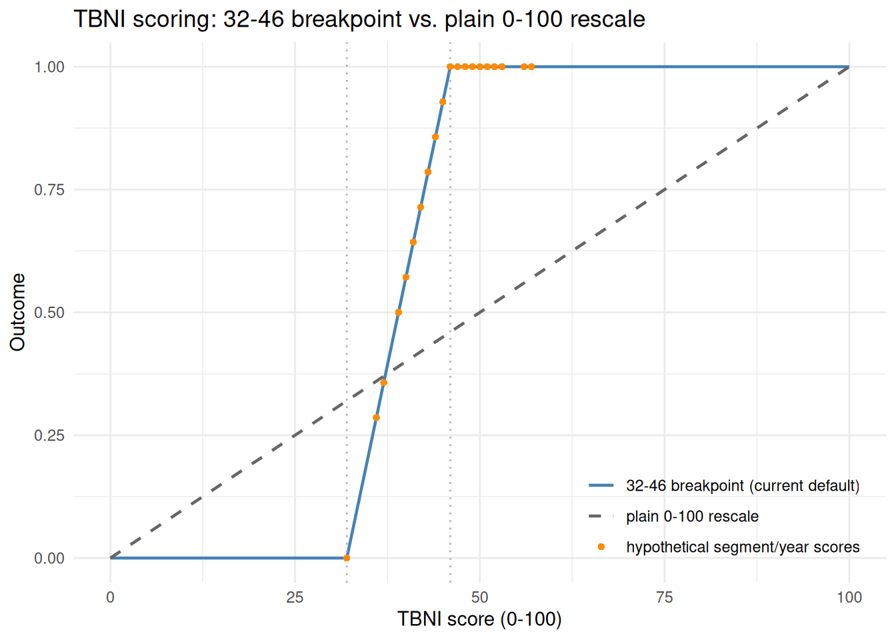
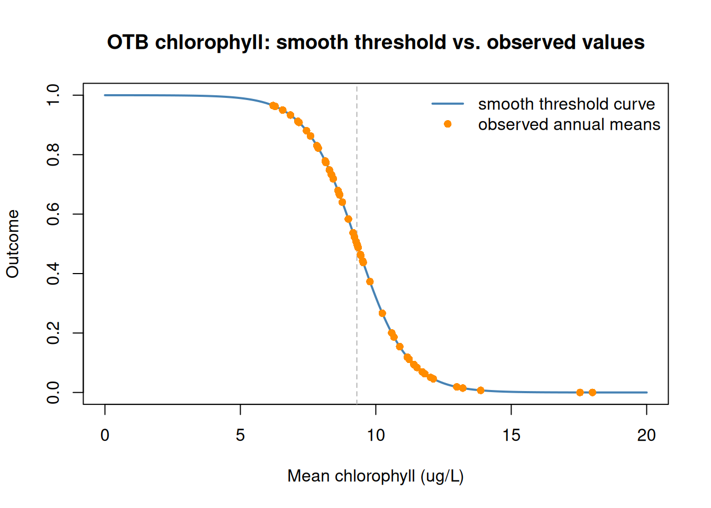
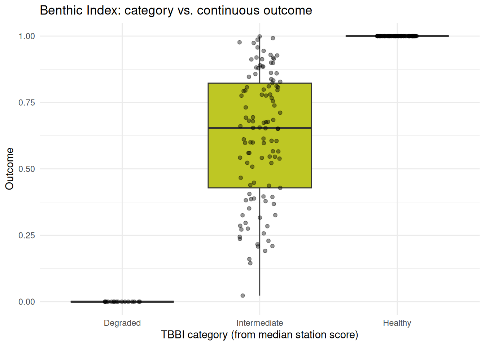
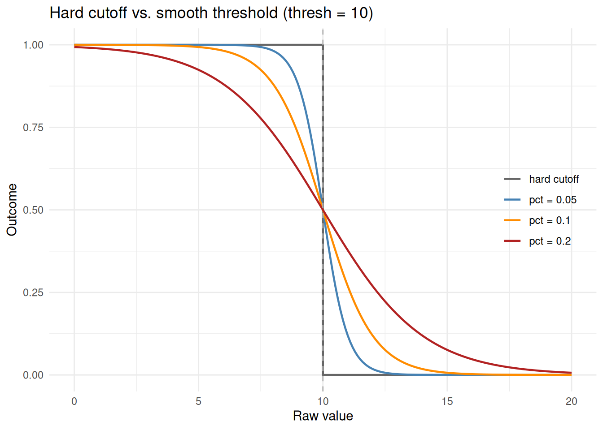
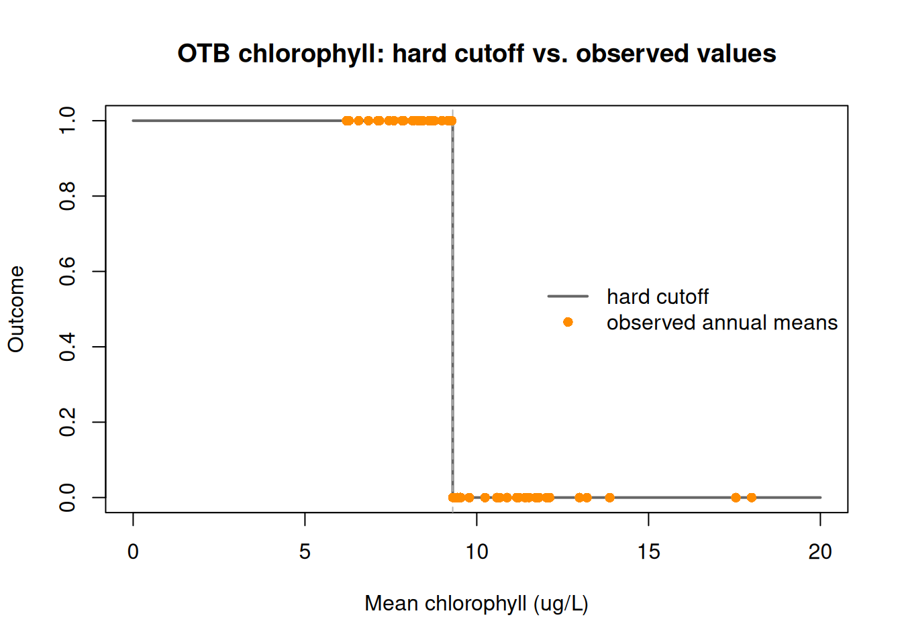
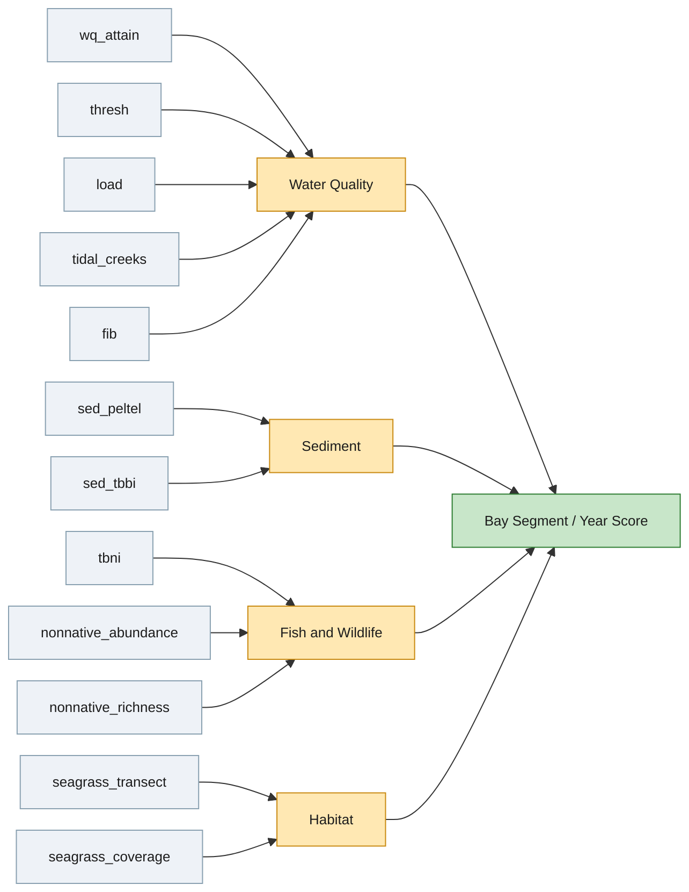
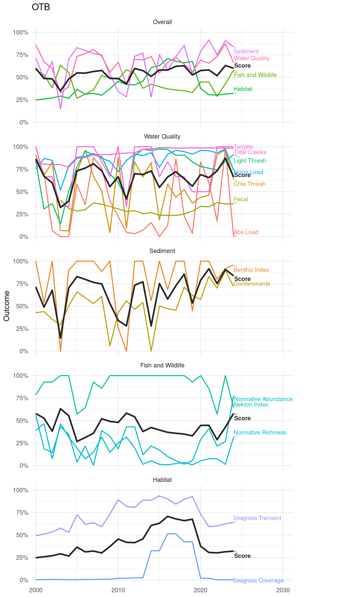

# Report Card Scoring

This article describes the full workflow for creating the bay segment
annual report card. This includes descriptions of computing each
individual indicator, converting raw indicator values to a common 0-1
outcome scale, combining indicators into category scores and an overall
bay segment score, and visualizing the results. The four categories -
Water Quality, Sediment, Fish and Wildlife, and Habitat - are each
covered below, followed by sections on scoring, combining, and plotting.

## Water Quality

### Targets

Combines chlorophyll and light attenuation attainment into a single
continuous outcome: the two sub-scores are summed, so a lower combined
sub-score (better attainment on both fronts) gives a higher outcome.
These outcomes come directly from the management targets for each bay
segment, as described in the tbeptools [water quality
vignette](https://tbep-tech.github.io/tbeptools/articles/intro.html).

``` r

wqattain <- anlz_wq_attain(epcdata)
```

### Chlorophyll and Light Thresholds

Compares annual mean chlorophyll and light attenuation values directly
against bay-segment-specific thresholds, independent of the combined
attainment score above. Each gives its own threshold outcome as a smooth
logistic transition by default or a hard binary 0/1 with
`smooth = FALSE` (see [Scoring](#scoring)).

``` r

wqthresh <- anlz_wq_thresh(epcdata)
```

### Nutrient and Hydrologic Loading

Compares total nitrogen load and a hydrologically-normalized loading
against fixed bay-segment thresholds, each as its own threshold
outcome - a smooth logistic transition by default, or a hard binary 0/1
with `smooth = FALSE` - see [Scoring](#scoring).

``` r

totanndat <- util_rdataload("https://github.com/tbep-tech/load-estimates/raw/main/data/totanndat.RData")
wqload <- anlz_wq_load(totanndat)
```

### Tidal Creeks

Assigns each tidal creek to a bay segment, then scores it continuously
from the same 10-year window of counts
(`monitor`/`caution`/`investigate`/ `prioritize`) behind its official
Prioritize/Investigate/Caution/Monitor condition category - a
count-weighted average across that category’s own ordinal scale, rather
than the category itself. Creek scores are then averaged by bay
segment/year, weighted by creek length so longer creek segments
contribute proportionally more.

``` r

wqtidalcreeks <- anlz_wq_tidalcreeks(tidalcreeks, iwrraw, yrs = 1975:2024)
```

### Fecal Indicator Bacteria

Scores each bay segment/year from enterococcus monitoring data using
`exceed_rate`, a continuous, one-sided 90% upper confidence estimate of
the true exceedance rate (0-1, lower is better), rescaled to an outcome
as `1 - exceed_rate`. This is a continuous analog of the A-E letter
grade the same underlying calculation also produces (`cat`), which is
itself a discretized version of `exceed_rate`.

``` r

wqfib <- anlz_wq_fib(enterodata)
```

## Sediment

### Contaminants

Scores each bay segment/year directly from its average sediment
contamination score (PEL/TEL, `ave`), log-transformed since its A-F
grade breakpoints are geometrically spaced, and rescaled continuously
between the A/B and D/F breakpoints (below/above which the outcome
clamps to 1/0). The A-F letter grade is still returned for reference,
but no longer used to compute the outcome.

``` r

peltel <- anlz_sed_peltel(sedimentdata, yrs = 1993:2024)
```

### Benthic Index

Scores each bay segment/year from the median of its station-level Tampa
Bay Benthic Index (TBBI) scores (0-100), rescaled continuously over
TBBI’s own grade breakpoints (Degraded below 73, Intermediate 73-87,
Healthy above 87) - the same breakpoint-window treatment used for the
Nekton Index. This bypasses the official Poor/Fair/Good bay segment
grade, which instead comes from the *proportion* of stations in each
condition category rather than a single continuous statistic.

``` r

tbbi <- anlz_sed_tbbi(benthicdata)
```

## Fish and Wildlife

### Nekton Index

Scores each bay segment/year 0-100 with the Tampa Bay Nekton Index
(TBNI), then rescales to an outcome using TBNI’s own grade breakpoints
(On Alert below 32, Caution from 32 to 46, Stay the Course above 46):
scores below 32 give an outcome of 0, scores above 46 give an outcome of
1, and scores in between are linearly rescaled.

``` r

tbni <- anlz_fw_tbni(fimdata)
```

### Non-natives

Ports the non-native species “report card” metrics from the
[tbep-invasives](https://github.com/tbep-tech) Python pipeline
(`src/tbep_invasives/steps/report_cards.py`) to R. Returns non-native
species abundance (observations per unit area per year) and richness
(unique species per unit area per year) by bay segment, converted to
percentiles and then reversed to an outcome (higher abundance/richness
is worse).

``` r

nonnative_obs <- anlz_fw_nonnative_obs()
nonnative_abundance <- anlz_fw_nonnative_abundance(nonnative_obs)
nonnative_richness  <- anlz_fw_nonnative_richness(nonnative_obs)
```

## Habitat

### Seagrass Transects

Estimates frequency of seagrass occurrence (0-100) at each bay
segment/year from transect monitoring data, then linearly rescales to an
outcome.

``` r

trnsct <- anlz_hab_seagrass_transect(transect)
```

### Seagrass Coverage

Compares mapped seagrass acreage against a fixed per-segment target (a
threshold outcome - a smooth logistic transition by default, or a hard
binary 0/1 with `smooth = FALSE` - see [Scoring](#scoring)), where the
targets are the baywide 40,000-acre seagrass coverage target apportioned
across segments by each segment’s share of total bay area. Coverage maps
are flown only every couple of years, so non-survey years carry forward
the most recent actual estimate and outcome.

``` r

cov <- anlz_hab_seagrass_coverage(sgsegest)
```

## Scoring

Every indicator above ends with the same step: a raw measurement is
converted to a 0-1 outcome, where 1 is always the best possible
condition. That conversion happens in one place,
[`util_outcome()`](https://tbep-tech.github.io/tbepreport/reference/util_outcome.md),
so how an indicator is scored can change without touching the `anlz_*`
function that uses it.
[`util_outcome()`](https://tbep-tech.github.io/tbepreport/reference/util_outcome.md)
supports three types:

- **Continuous** - a raw value is linearly rescaled to 0-1 over a
  specified range, clamped so values outside that range are pinned to 0
  or 1 rather than extrapolated. This can occur for the full range of
  raw values (e.g., seagrass transect frequency of occurrence over its
  full 0-100 range) or within a subset range of the raw values (e.g.,
  the Nekton Index’s 0-100 score rescaled over just its 32-46 breakpoint
  window, or the Benthic Index’s median station score over its 73-87
  breakpoint window). FIB’s `exceed_rate` is also scored this way,
  reversed since lower is better (`from = c(0, 1)`, `reverse = TRUE`),
  as is sediment PEL/TEL’s average contamination score - log-transformed
  first since its grade breakpoints are geometrically spaced, rather
  than linear. Tidal creeks are scored continuously too, as a
  count-weighted average across the same ordinal scale their official
  condition category uses, computed directly rather than through
  [`util_outcome()`](https://tbep-tech.github.io/tbepreport/reference/util_outcome.md).
- **Category** - a discrete grade or condition category is mapped to a
  fixed outcome. No indicator currently uses this type (they’ve each
  moved to a continuous score derived from the same data the category
  would have used), but it remains available for a grade or category
  with no natural continuous equivalent.
- **Threshold** - a raw value is compared against a cutoff
  (e.g. nutrient loading against a bay-segment target, chlorophyll/light
  attenuation against their thresholds, seagrass coverage against an
  acreage target). By default this gives a smooth logistic outcome:
  exactly 0.5 at the threshold, moving quickly toward 0 or 1 (depending
  on direction) as a value moves away from it, so values close to the
  threshold are penalized less harshly than a hard cutoff would. The
  steepness of that transition is set by `pct`, a fraction of the
  threshold itself (default 10%) rather than a fixed absolute value, so
  it stays meaningful across indicators/segments with very different
  thresholds. Setting `smooth = FALSE` instead gives a hard binary 0 or
  1.

``` r

# continuous: linearly rescale a raw value between known bounds
util_outcome(75, type = 'continuous', from = c(0, 100))
#> [1] 0.75

# category: map a discrete grade to a fixed outcome
util_outcome('B', type = 'category', levels = c(A = 1, B = 0.75, C = 0.5, D = 0.25, F = 0))
#> [1] 0.75

# threshold: smooth by default, a logistic transition centered on the cutoff
util_outcome(8, type = 'threshold', thresh = 10, op = '<')
#> [1] 0.8807971

# threshold, smooth = FALSE: a hard binary cutoff instead
util_outcome(8, type = 'threshold', thresh = 10, op = '<', smooth = FALSE)
#> [1] 1
```

### Continuous Example

The plot below compares how the Nekton Index’s 0-100 score is rescaled
to an outcome under the current default (`from = c(32, 46)`, TBNI’s own
grade breakpoints - clamped so anything below 32 is 0 and above 46 is 1)
versus how it was previously scored (`from = c(0, 100)`, a plain linear
rescale over the full range, with no clamping needed since no score
falls outside 0-100). Each bay segment/year’s actual TBNI score (from
`tbni`, computed earlier) is overlaid on the current curve - most
observed scores fall inside or above the 32-46 breakpoint window, where
the two methods diverge most.



### Sediment Contaminants Example

The plot below shows each bay segment/year’s average PEL/TEL score
(`ave`) against its continuous outcome, colored by the A-F grade (`grd`)
that same `ave` value would have received (kept for reference, but no
longer used to compute the outcome). The grey curve is the theoretical
relationship - linear in `log(ave)`, clamped to 1 below the A/B
breakpoint and to 0 above the D/F breakpoint - that every point falls
exactly on, since `outcome` is computed directly from `ave`:



### Benthic Index Example

[`anlz_sed_tbbi()`](https://tbep-tech.github.io/tbepreport/reference/anlz_sed_tbbi.md)
no longer returns a bay segment category (it bypasses
[`anlz_tbbimed()`](https://rdrr.io/pkg/tbeptools/man/anlz_tbbimed.html)’s
Poor/Fair/Good grade entirely - see [Benthic Index](#benthic-index)), so
the plot below instead bins the same median station score (`TBBI`) it
scores continuously into Degraded/ Intermediate/Healthy using TBBI’s own
73/87 breakpoints, purely to show how that category relates to the
continuous outcome. As with PEL/TEL, the two outer categories sit at the
clamped boundaries (Degraded always 0, Healthy always 1), with
Intermediate spanning the continuous range between them:



### Smooth vs. Hard Threshold Example

The plot below compares the hard cutoff to the smooth logistic outcome
at a few `pct` values, for an arbitrary threshold of 10: all three
smooth curves cross 0.5 exactly at the threshold, and a larger `pct`
widens the transition around it.


Applying this to Old Tampa Bay’s chlorophyll threshold (9.3 ug/L)
demonstrates how many observed annual means actually fall within the
default 10% transition band: about two-thirds of OTB’s 52 years of data
land between outcomes of 0.1 and 0.9, since a value tracked against a
management target tends to hover close to it. For an indicator like
this, the default smooth scoring meaningfully changes scoring for a
majority of years, not just a few borderline ones (compared to
`smooth = FALSE`):



For comparison, here is the same OTB chlorophyll data scored with
`smooth = FALSE` - a hard binary cutoff instead of the logistic
transition above. Every point lands on exactly 0 or 1, regardless of how
close its value is to the 9.3 ug/L threshold:



## Combining Scores

Once every indicator has a 0-1 outcome, three functions combine them
into increasingly aggregated scores. The diagram below shows the full
hierarchy for a single bay segment/year: each category’s indicators
(named as they’re passed into
[`anlz_indicators()`](https://tbep-tech.github.io/tbepreport/reference/anlz_indicators.md)/[`anlz_category()`](https://tbep-tech.github.io/tbepreport/reference/anlz_category.md)
below) funnel into that category’s score, and the four category scores
funnel into the single overall score.



- [`anlz_indicators()`](https://tbep-tech.github.io/tbepreport/reference/anlz_indicators.md)
  stacks any number of named indicator data.frames into one long table
  (`bay_segment`, `yr`, `indicator`, `outcome`), without filling in gaps
  where an indicator has no data for a given segment/year.
- [`anlz_category()`](https://tbep-tech.github.io/tbepreport/reference/anlz_category.md)
  calls
  [`anlz_indicators()`](https://tbep-tech.github.io/tbepreport/reference/anlz_indicators.md)
  internally, then averages `outcome` within each bay segment/year to
  get a category score - the result also keeps one wide column per
  indicator, so the indicators behind a category score stay visible
  alongside it.
- [`anlz_score()`](https://tbep-tech.github.io/tbepreport/reference/anlz_score.md)
  is a thin wrapper around
  [`anlz_category()`](https://tbep-tech.github.io/tbepreport/reference/anlz_category.md):
  the four category scores are themselves just another set of
  “indicators” to average, giving the overall bay segment score.

``` r

wqoverall <- anlz_category(
  wq_attain = wqattain, 
  thresh = wqthresh, 
  load = wqload, 
  tidal_creeks = wqtidalcreeks, 
  fib = wqfib
)
```

``` r

sedoverall <- anlz_category(
  sed_peltel = peltel, 
  sed_tbbi = tbbi
)
```

``` r

fwoverall <- anlz_category(
  tbni                 = tbni,
  nonnative_abundance  = nonnative_abundance,
  nonnative_richness   = nonnative_richness
)
```

``` r

haboverall <- anlz_category(
  seagrass_transect = trnsct,
  seagrass_coverage = cov
)
```

``` r

score <- anlz_score(wqoverall, sedoverall, fwoverall, haboverall)
```

## Visualizing Scores

[`plot_category()`](https://tbep-tech.github.io/tbepreport/reference/plot_category.md)
and
[`plot_score()`](https://tbep-tech.github.io/tbepreport/reference/plot_score.md)
both plot a two- or three-ring sunburst - a colored center hole for the
overall score, surrounded by a ring per component, each colored on the
same continuous red/yellow/green outcome scale.
[`plot_category()`](https://tbep-tech.github.io/tbepreport/reference/plot_category.md)
takes the same named indicator data.frames as
[`anlz_category()`](https://tbep-tech.github.io/tbepreport/reference/anlz_category.md)
(and calls it internally) to plot one category’s indicators around its
score, for a chosen bay segment and year:

``` r

plot_category(
  wq_attain    = wqattain,
  thresh       = wqthresh,
  load         = wqload,
  tidal_creeks = wqtidalcreeks,
  fib          = wqfib,
  bay_segment = 'OTB', yr = 2024
)
```

``` r

plot_category(sed_peltel = peltel, sed_tbbi = tbbi, bay_segment = 'OTB', yr = 2024)
```

``` r

plot_category(
  tbni                = tbni,
  nonnative_abundance = nonnative_abundance,
  nonnative_richness  = nonnative_richness,
  bay_segment = 'OTB', yr = 2024
)
```

``` r

plot_category(
  seagrass_transect = trnsct,
  seagrass_coverage = cov,
  bay_segment = 'OTB', yr = 2024
)
```

[`plot_score()`](https://tbep-tech.github.io/tbepreport/reference/plot_score.md)
takes the same four category data.frames as
[`anlz_score()`](https://tbep-tech.github.io/tbepreport/reference/anlz_score.md)
(and calls it internally) to plot the full hierarchy - indicators, then
categories, then the overall score - for a chosen bay segment and year:

``` r

plot_score(wqoverall, sedoverall, fwoverall, haboverall, bay_segment = 'OTB', yr = 2024)
```

Unlike the sunburst plots above, which show one bay segment/year at a
time,
[`plot_trend()`](https://tbep-tech.github.io/tbepreport/reference/plot_trend.md)
shows every year at once for a chosen bay segment: five stacked facets,
an “Overall” facet with the bay segment score and one line per category,
followed by one facet per category with that category’s own score and
one line per indicator. In every facet the score itself is a bold dark
line, and its components are thinner colored lines labeled directly at
their right-most point (rather than a single shared legend, which would
otherwise have to list every category and indicator name at once):

``` r

plot_trend(wqoverall, sedoverall, fwoverall, haboverall, bay_segment = 'OTB', 
  yr_range = c(2000, 2024))
```



## Notes

- Lots of redundancy in the water quality indicators
- How to incorporate land use change by bay segment? Is this even
  appropriate?
