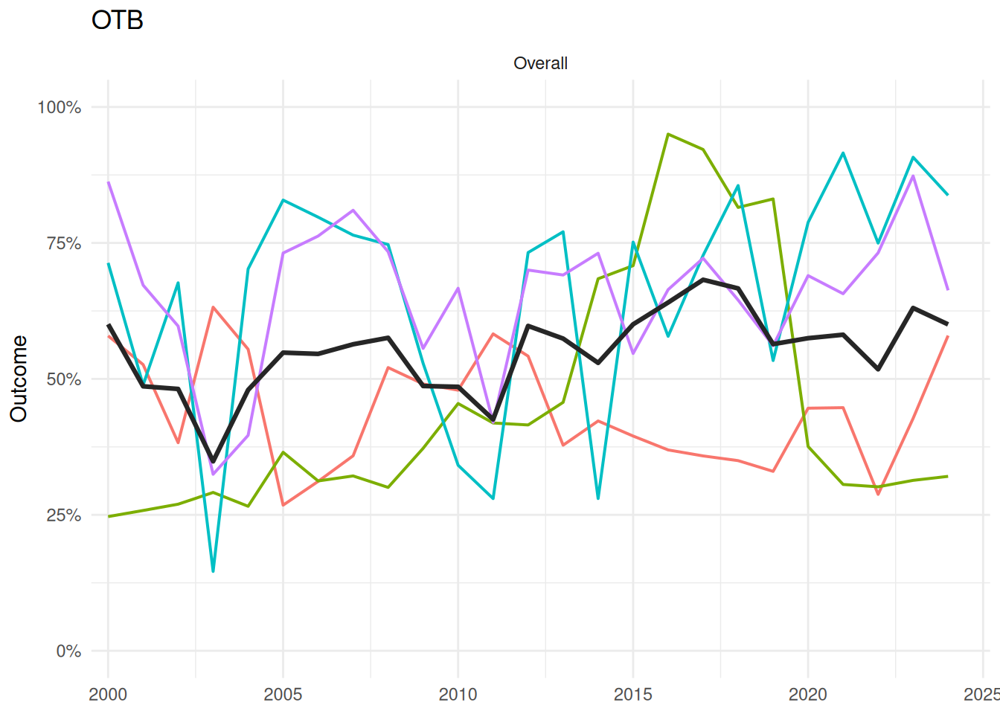
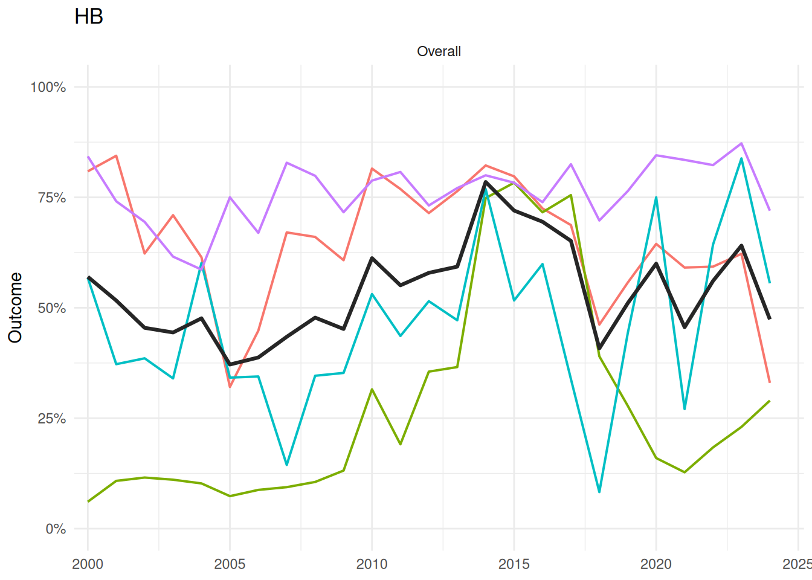
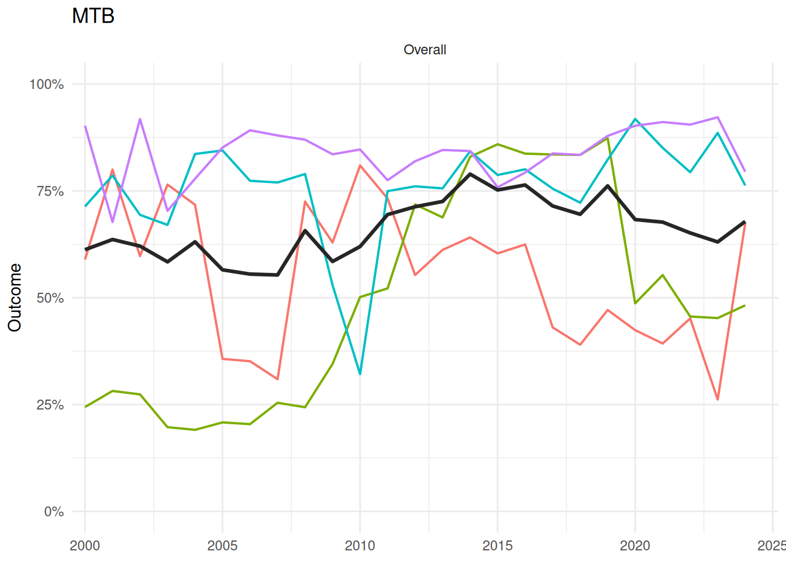
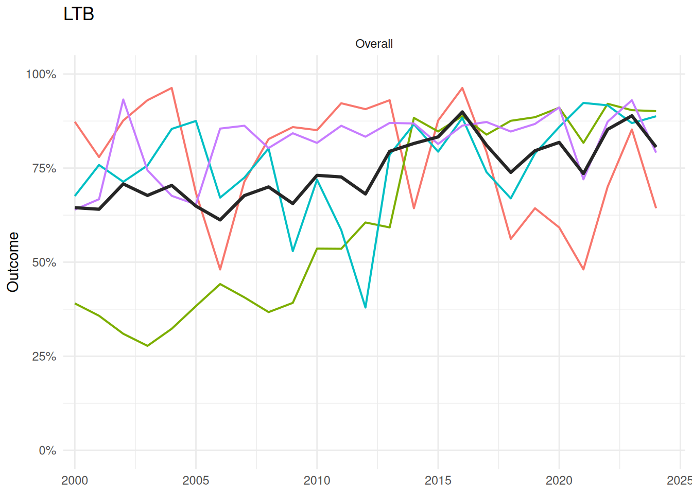
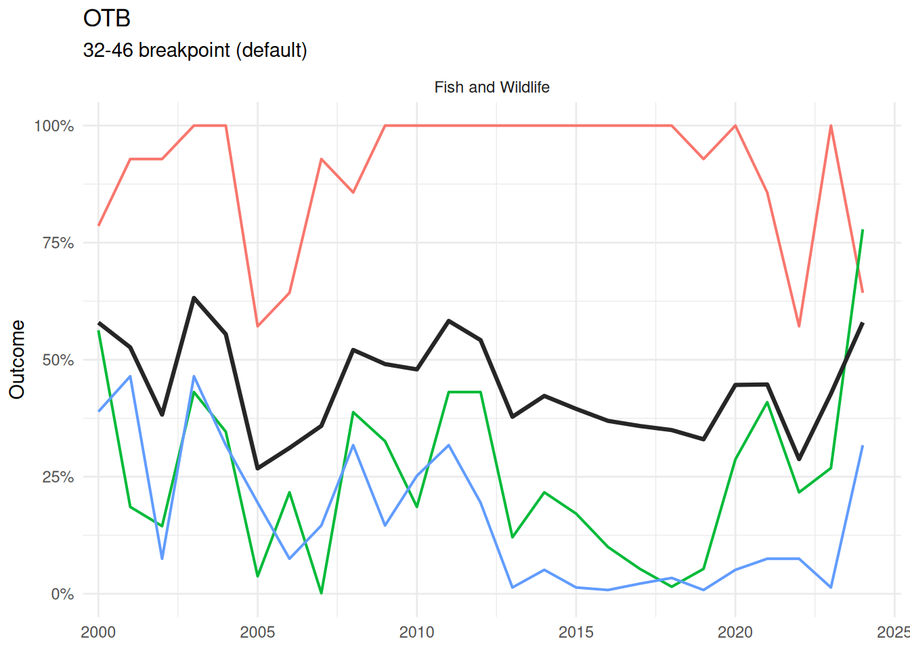
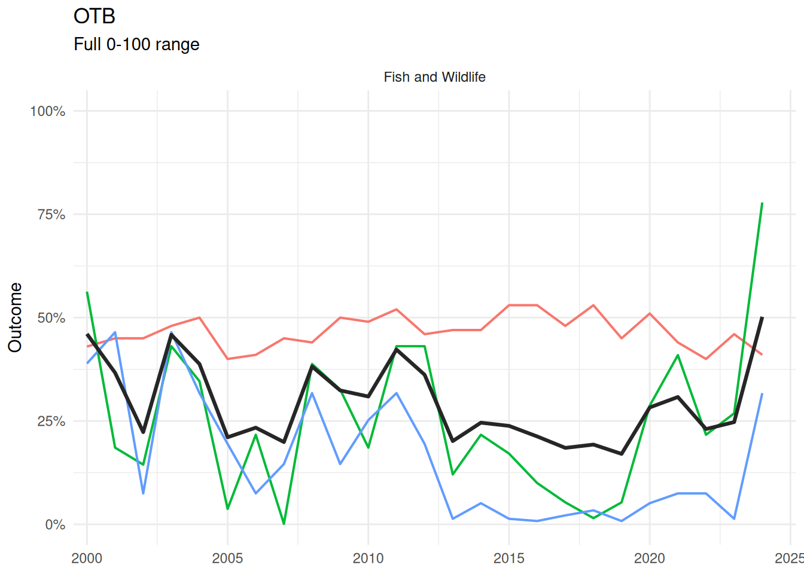
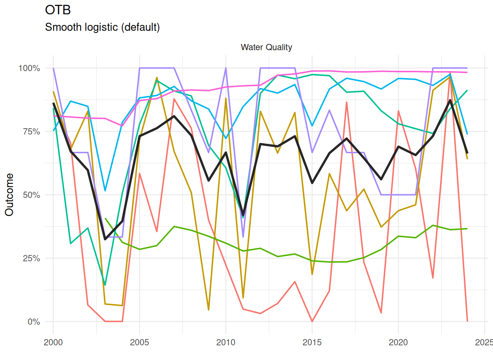
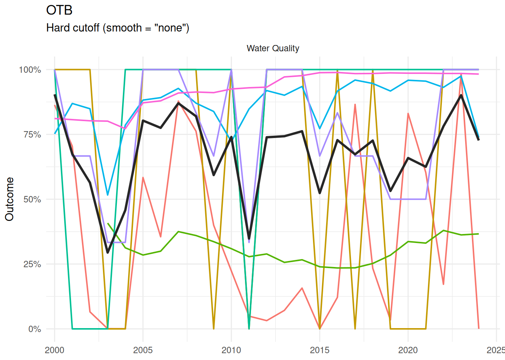
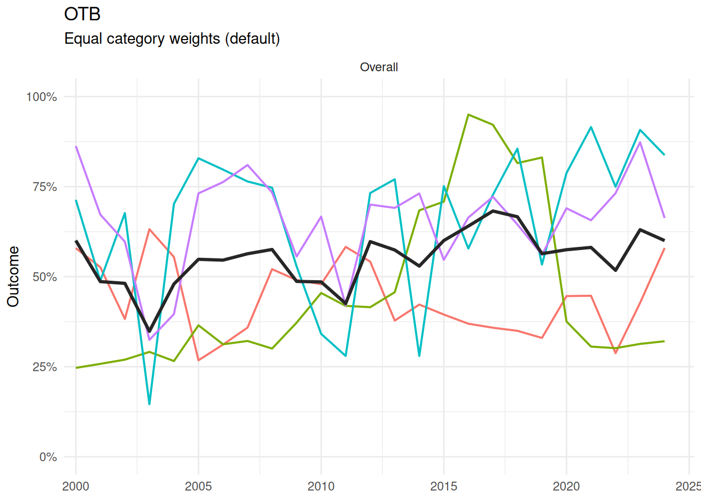
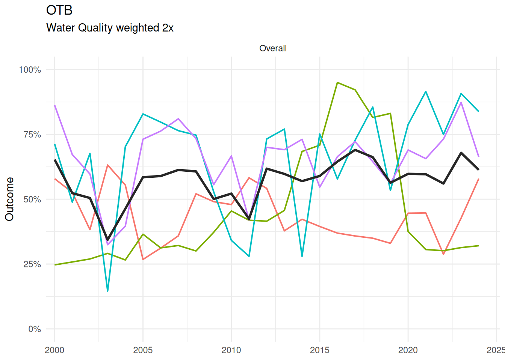

# Trends and Sensitivity

This article has two parts. The first compares report card results
across bay segments, both as trends from 2000-2024 and as a snapshot of
2024 conditions. The second shows how scoring decisions (highlighted in
the [Report Card
Scoring](https://tbep-tech.github.io/tbepreport/articles/scoring.md)
article) can change the results, using the Nekton Index’s rescaling
window, threshold smoothing, and category weights as examples.

## Setup

Indicators and category scores are built the same way as in [Report Card
Scoring](https://tbep-tech.github.io/tbepreport/articles/scoring.md),
for the four default bay segments (`OTB`, `HB`, `MTB`, `LTB`).

``` r

bay_segments <- c('OTB', 'HB', 'MTB', 'LTB')

wqattain <- anlz_wq_attain(epcdata)
wqthresh <- anlz_wq_thresh(epcdata)
totanndat <- util_rdataload("https://github.com/tbep-tech/load-estimates/raw/main/data/totanndat.RData")
wqload <- anlz_wq_load(totanndat)
wqtidalcreeks <- anlz_wq_tidalcreeks(tidalcreeks, iwrraw, yrs = 1990:2024)
wqfib <- anlz_wq_fib(enterodata)

peltel <- anlz_sed_peltel(sedimentdata, yrs = 1993:2024)
tbbi <- anlz_sed_tbbi(benthicdata)

tbni <- anlz_fw_tbni(fimdata)
nonnative_obs <- anlz_fw_nonnative_obs()
nonnative_abundance <- anlz_fw_nonnative_abundance(nonnative_obs)
nonnative_richness  <- anlz_fw_nonnative_richness(nonnative_obs)

trnsct <- anlz_hab_seagrass_transect(transect)
cov <- anlz_hab_seagrass_coverage(sgsegest)

wqoverall <- anlz_category(
  wq_attain    = wqattain,
  thresh       = wqthresh,
  load         = wqload,
  tidal_creeks = wqtidalcreeks,
  fib          = wqfib
)
sedoverall <- anlz_category(
  sed_peltel = peltel,
  sed_tbbi   = tbbi
)
fwoverall <- anlz_category(
  tbni                = tbni,
  nonnative_abundance = nonnative_abundance,
  nonnative_richness  = nonnative_richness
)
haboverall <- anlz_category(
  seagrass_transect = trnsct,
  seagrass_coverage = cov
)
```

## Part 1: Comparing Bay Segments

### Trends by Bay Segment

Each panel below shows one bay segment’s overall score from 2000-2024
(the “Overall” facet from
[`plot_trend()`](https://tbep-tech.github.io/tbepreport/reference/plot_trend.md)).
Labels are turned off since they would collide at this smaller panel
size.

``` r

for (seg in bay_segments) {
  p <- plot_trend(
    wqoverall, sedoverall, fwoverall, haboverall, bay_segment = seg,
    yr_range = c(2000, 2024), facets = 'Overall', labels = FALSE
  )
  print(p)
}
```









### 2024 Snapshot by Bay Segment

Each sunburst below shows the same 2024 outcome scale across all four
bay segments. Color ranges are the same across plots for visual
comparison of score ranges.

``` r

htmltools::tagList(lapply(bay_segments, function(seg) {
  plot_score(wqoverall, sedoverall, fwoverall, haboverall, bay_segment = seg, yr = 2024)
}))
```

## Part 2: How Scoring Decisions Affect Results

### Nekton Index: Breakpoint Window vs. Full Range

[`anlz_fw_tbni()`](https://tbep-tech.github.io/tbepreport/reference/anlz_fw_tbni.md)
defaults to rescaling the Nekton Index’s 0-100 score over its own 32-46
grade breakpoints (`from = c(32, 46)`). Passing `from = c(0, 100)`
instead spreads sensitivity evenly across the full range rather than
concentrating it near the breakpoints.

``` r

tbni_full <- anlz_fw_tbni(fimdata, from = c(0, 100))
fwoverall_full <- anlz_category(
  tbni                = tbni_full,
  nonnative_abundance = nonnative_abundance,
  nonnative_richness  = nonnative_richness
)

plot_trend(
  wqoverall, sedoverall, fwoverall, haboverall, bay_segment = 'OTB',
  facets = 'fw', labels = FALSE, yr_range = c(2000, 2024)
) +
  labs(subtitle = '32-46 breakpoint (default)')

plot_trend(
  wqoverall, sedoverall, fwoverall_full, haboverall, bay_segment = 'OTB',
  facets = 'fw', labels = FALSE, yr_range = c(2000, 2024)
) +
  labs(subtitle = 'Full 0-100 range')
```





### Threshold Scoring: Smooth vs. Hard Cutoff

[`anlz_wq_thresh()`](https://tbep-tech.github.io/tbepreport/reference/anlz_wq_thresh.md)
defaults to a smooth logistic transition at each bay segment’s
chlorophyll/light attenuation threshold (`smooth = 'logistic'`).
`smooth = 'none'` instead uses a hard 0/1 cutoff, as described in
[Report Card
Scoring](https://tbep-tech.github.io/tbepreport/articles/scoring.html#smooth-vs.-hard-threshold-example).

``` r

wqthresh_hard <- anlz_wq_thresh(epcdata, smooth = 'none')
wqoverall_hard <- anlz_category(
  wq_attain    = wqattain,
  thresh       = wqthresh_hard,
  load         = wqload,
  tidal_creeks = wqtidalcreeks,
  fib          = wqfib
)

plot_trend(
  wqoverall, sedoverall, fwoverall, haboverall, bay_segment = 'OTB',
  facets = 'wq', labels = FALSE, yr_range = c(2000, 2024)
) +
  labs(subtitle = 'Smooth logistic (default)')

plot_trend(
  wqoverall_hard, sedoverall, fwoverall, haboverall, bay_segment = 'OTB',
  facets = 'wq', labels = FALSE, yr_range = c(2000, 2024)
) +
  labs(subtitle = 'Hard cutoff (smooth = "none")')
```





### Category Weights

[`anlz_score()`](https://tbep-tech.github.io/tbepreport/reference/anlz_score.md)’s
`wt` argument weights the four category scores when combining them into
the overall score (default `NULL`, equal weight). Below, Water Quality
is upweighted twice relative to the other three categories.

``` r

plot_trend(
  wqoverall, sedoverall, fwoverall, haboverall, bay_segment = 'OTB',
  facets = 'Overall', labels = FALSE, yr_range = c(2000, 2024)
) +
  labs(subtitle = 'Equal category weights (default)')

plot_trend(
  wqoverall, sedoverall, fwoverall, haboverall, bay_segment = 'OTB',
  facets = 'Overall', labels = FALSE, wt = c(wq = 2, sed = 1, fw = 1, hab = 1), 
  yr_range = c(2000, 2024)
) +
  labs(subtitle = 'Water Quality weighted 2x')
```




