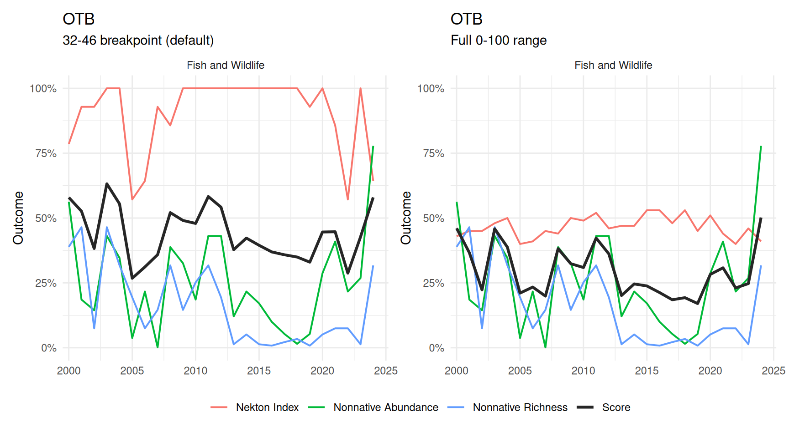
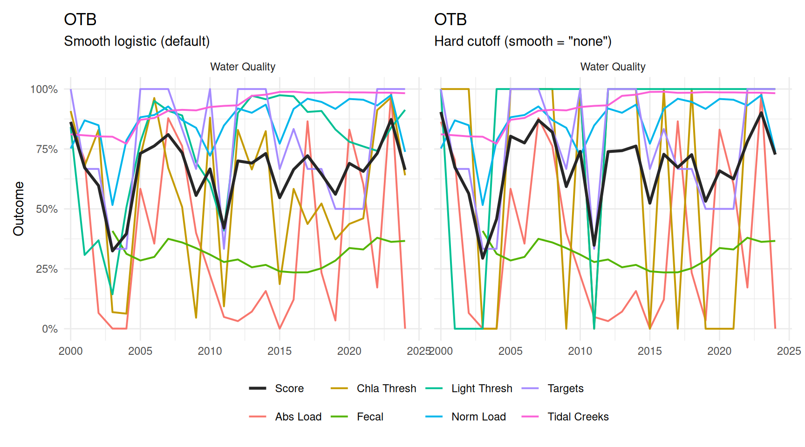
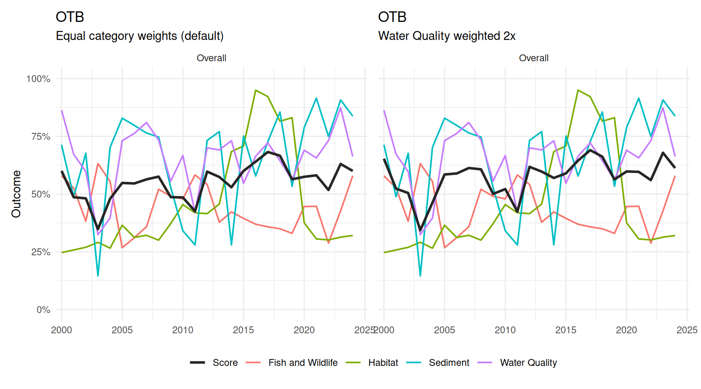

# Trends and Sensitivity

This article shows a comparison of report card results across bay
segments and how scoring decisions can change the results. Please see
the [Report Card
Scoring](https://tbep-tech.github.io/tbepreport/articles/scoring.md)
article for more information on the methods.

## Setup

Indicators and category scores are built the same way as in [Report Card
Scoring](https://tbep-tech.github.io/tbepreport/articles/scoring.md),
for the four default bay segments (`OTB`, `HB`, `MTB`, `LTB`).

``` r

bay_segments <- c('OTB', 'HB', 'MTB', 'LTB')

wqattain <- anlz_wq_attain(epcdata)
wqthresh <- anlz_wq_thresh(epcdata)
totanndat <- util_rdataload("https://github.com/tbep-tech/load-estimates/raw/main/data/totanndat.RData")
wqload <- anlz_wq_load(totanndat)
wqtidalcreeks <- anlz_wq_tidalcreeks(tidalcreeks, iwrraw, yrs = 1990:2024)
wqfib <- anlz_wq_fib(enterodata)

peltel <- anlz_sed_peltel(sedimentdata, yrs = 1993:2024)
tbbi <- anlz_sed_tbbi(benthicdata)

tbni <- anlz_fw_tbni(fimdata)
nonnative_obs <- anlz_fw_nonnative_obs()
nonnative_abundance <- anlz_fw_nonnative_abundance(nonnative_obs)
nonnative_richness  <- anlz_fw_nonnative_richness(nonnative_obs)

trnsct <- anlz_hab_seagrass_transect(transect)
cov <- anlz_hab_seagrass_coverage(sgsegest)

wqoverall <- anlz_category(
  wq_attain    = wqattain,
  thresh       = wqthresh,
  load         = wqload,
  tidal_creeks = wqtidalcreeks,
  fib          = wqfib
)
sedoverall <- anlz_category(
  sed_peltel = peltel,
  sed_tbbi   = tbbi
)
fwoverall <- anlz_category(
  tbni                = tbni,
  nonnative_abundance = nonnative_abundance,
  nonnative_richness  = nonnative_richness
)
haboverall <- anlz_category(
  seagrass_transect = trnsct,
  seagrass_coverage = cov
)
```

## Comparing Bay Segments

### Trends

The plot below shows each bay segment’s overall score from 2000-2024.
Only the overall scores by category are shown (water quality, sediment,
fish & wildlife, habitat).

``` r

plots <- lapply(bay_segments, function(seg) {
  plot_trend(
    wqoverall, sedoverall, fwoverall, haboverall, bay_segment = seg,
    yr_range = c(2000, 2024), facets = 'Overall', text = 'legend'
  )
})

patchwork::wrap_plots(plots, ncol = 2) +
  patchwork::plot_layout(guides = 'collect', axes = 'collect') &
  theme(legend.position = 'bottom')
```


### 2024 Snapshot by Bay Segment

The plots below show the 2024 outcome for each bay segment, including
the overall score, scores by category, and individual indicator scores
within each category. Color ranges are the same across plots for visual
comparison of score ranges.

``` r

plot_score(wqoverall, sedoverall, fwoverall, haboverall, bay_segment = 'OTB', yr = 2024)
plot_score(wqoverall, sedoverall, fwoverall, haboverall, bay_segment = 'HB', yr = 2024)
plot_score(wqoverall, sedoverall, fwoverall, haboverall, bay_segment = 'MTB', yr = 2024)
plot_score(wqoverall, sedoverall, fwoverall, haboverall, bay_segment = 'LTB', yr = 2024)
```

## How Scoring Decisions Affect Results

The following demonstrates a few examples of how scoring decisions can
affect the results. This is not a comprehensive demonstration, rather
the intent is to provide a general overview of the sensitivity of the
method to different decisions that can be made by the analyst. All
examples use results from OTB.

### Nekton Index: Breakpoint Window vs. Full Range

[`anlz_fw_tbni()`](https://tbep-tech.github.io/tbepreport/reference/anlz_fw_tbni.md)
defaults to rescaling the Nekton Index’s 0-100 score over its own 32-46
grade breakpoints (`from = c(32, 46)`). Values below 32 receive an
outcome of 0 and those above 46 receive an outcome of 1. Passing
`from = c(0, 100)` instead spreads sensitivity evenly across the full
range rather than concentrating it near the breakpoints.

``` r

tbni_full <- anlz_fw_tbni(fimdata, from = c(0, 100))
fwoverall_full <- anlz_category(
  tbni                = tbni_full,
  nonnative_abundance = nonnative_abundance,
  nonnative_richness  = nonnative_richness
)

p1 <- plot_trend(
  wqoverall, sedoverall, fwoverall, haboverall, bay_segment = 'OTB',
  facets = 'fw', text = 'legend', yr_range = c(2000, 2024)
) +
  labs(subtitle = '32-46 breakpoint (default)')

p2 <- plot_trend(
  wqoverall, sedoverall, fwoverall_full, haboverall, bay_segment = 'OTB',
  facets = 'fw', text = 'legend', yr_range = c(2000, 2024)
) +
  labs(subtitle = 'Full 0-100 range')

patchwork::wrap_plots(p1, p2, ncol = 2) +
  patchwork::plot_layout(guides = 'collect', axes = 'collect') &
  theme(legend.position = 'bottom')
```



### Threshold Scoring: Smooth vs. Hard Cutoff

The
[`anlz_wq_thresh()`](https://tbep-tech.github.io/tbepreport/reference/anlz_wq_thresh.md)
and
[`anlz_wq_load()`](https://tbep-tech.github.io/tbepreport/reference/anlz_wq_load.md)
indicators are scored against a threshold (chlorophyll/light attenuation
and total/normalized nutrient loading) and both default to a smooth
logistic transition at their threshold (`smooth = 'logistic'`).
`smooth = 'none'` instead uses a hard 0/1 cutoff, as described in
[Report Card
Scoring](https://tbep-tech.github.io/tbepreport/articles/scoring.html#smooth-vs.-hard-threshold-example).
The other three water quality indicators (`wq_attain`, `tidal_creeks`,
`fib`) are continuous rather than threshold-based and are unaffected
here.  
Note the differences in `Chla Thresh`, `Light Thresh`, `Abs Load`, and
`Norm Load` scores between the two plots, as well as the overall score.

``` r

wqthresh_hard <- anlz_wq_thresh(epcdata, smooth = 'none')
wqload_hard <- anlz_wq_load(totanndat, smooth = 'none')
wqoverall_hard <- anlz_category(
  wq_attain    = wqattain,
  thresh       = wqthresh_hard,
  load         = wqload_hard,
  tidal_creeks = wqtidalcreeks,
  fib          = wqfib
)

p1 <- plot_trend(
  wqoverall, sedoverall, fwoverall, haboverall, bay_segment = 'OTB',
  facets = 'wq', text = 'legend', yr_range = c(2000, 2024)
) +
  labs(subtitle = 'Smooth logistic (default)')

p2 <- plot_trend(
  wqoverall_hard, sedoverall, fwoverall, haboverall, bay_segment = 'OTB',
  facets = 'wq', text = 'legend', yr_range = c(2000, 2024)
) +
  labs(subtitle = 'Hard cutoff (smooth = "none")')

patchwork::wrap_plots(p1, p2, ncol = 2) +
  patchwork::plot_layout(guides = 'collect', axes = 'collect') &
  theme(legend.position = 'bottom')
```



### Category Weights

[`anlz_score()`](https://tbep-tech.github.io/tbepreport/reference/anlz_score.md)’s
`wt` argument weights the four category scores when combining them into
the overall score (default `NULL`, equal weight). Below, habitat is
upweighted twice relative to the other three categories.

``` r

p1 <- plot_trend(
  wqoverall, sedoverall, fwoverall, haboverall, bay_segment = 'OTB',
  facets = 'Overall', text = 'legend', yr_range = c(2000, 2024)
) +
  labs(subtitle = 'Equal category weights (default)')

p2 <- plot_trend(
  wqoverall, sedoverall, fwoverall, haboverall, bay_segment = 'OTB',
  facets = 'Overall', text = 'legend', yr_range = c(2000, 2024),
  wt = c(wq = 1, sed = 1, fw = 1, hab = 2)
) +
  labs(subtitle = 'Habitat weighted 2x')

patchwork::wrap_plots(p1, p2, ncol = 2) +
  patchwork::plot_layout(guides = 'collect', axes = 'collect') &
  theme(legend.position = 'bottom')
```


